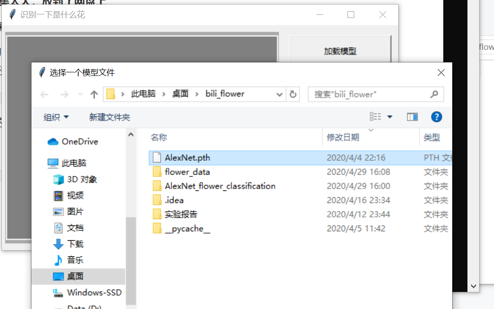
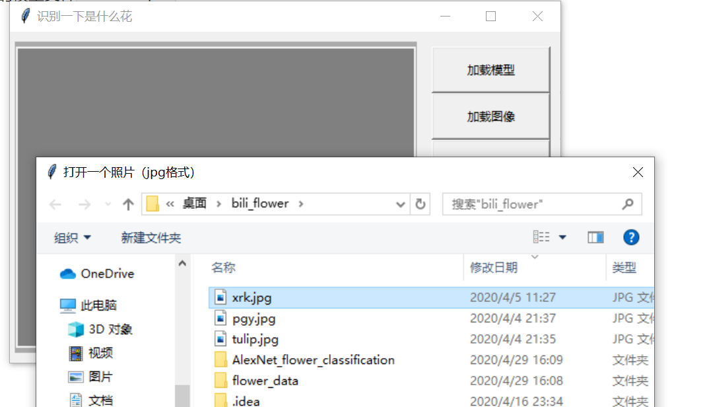
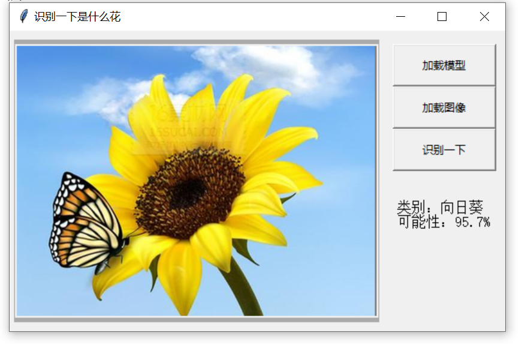

# CNN样例: 使用AlexNet模型对于花朵图片进行分类

**训练用的数据集太大，放到了网盘上**

**训练的时候注意先下载下来放到```flower_data```文件夹里**

```train.py```是训练脚本
```GUI.py```是图形界面

```AlexNet.pth```是已经训练好的模型

有3张测试用的图片 ```pgy.jpg```/```xrk.jpg```/```yjx.jpg```


图形界面```GUI.py```使用方法

1. 先加载训练好的模型文件```AlexNet.pth```

   

   

   2. 再去网上找一个鲜花图片（```雏菊```、``` 蒲公英```、```玫瑰```、```向日葵```、```郁金香``` 之一），要求```.jpg```格式，在程序中加载这个图片

      

      

      3. 点击识别按钮进行识别预测

         

      

   

